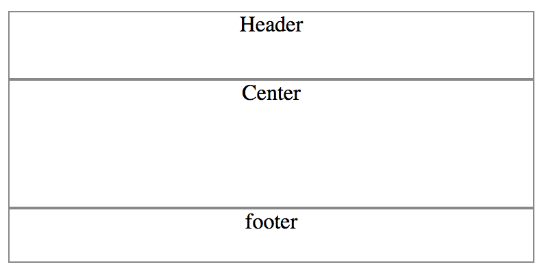
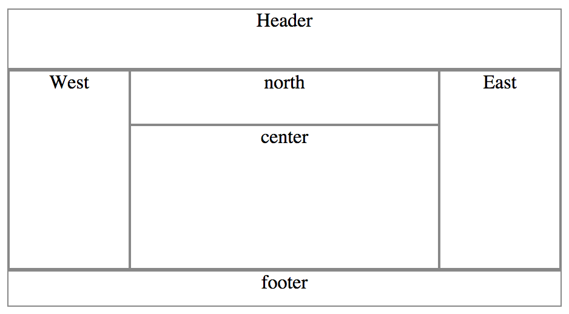

经常用到上下左右，中间填充满这样的布局，在java swing中有BorderLayout，HTML中通常使用CSS来实现布局，但要实现border layout这样的效果有些麻烦，很多第三方实现，比如easyui, extjs，功能过于强大，我只是想要一个简单的布局而已，于是自己写了个jquery布局插件，支持嵌套布局以及小功能，方便和团队使用

# 简介
简单的布局效果，实现上下左右，中间充满的布局

# 依赖
需要用到jquery

# 使用bower
```bower install layout.border
```
# 示例
##首先引入jquery.js和layout.border.js
```js
    <script src="../lib/jquery.js"></script>
    <script src="../src/layout.border.js"></script>
```
##然后按下面的格式组织html
```html
    <body class="layout">
        <header data-options="region:'north', height: '50'">
            Header
        </header>
        <div data-options="region:'center'">
            Center
        </div>
        <footer data-options="region:'south', height: '40'">
            footer
        </footer>
    </body>
```

##完整示例：
```html
<!doctype html>
<html>
<head>
    <meta charset="utf-8">
    <title>Border Layout Demo</title>
    <style>
        div, header, footer {
            border: solid 1px #888;
            text-align: center;
        }
    </style>
    <script src="../lib/jquery.js"></script>
    <script src="../src/layout.border.js"></script>
</head>
<body class="layout">
    <header data-options="region:'north', height: '50'">
        Header
    </header>
    <div data-options="region:'center'">
        Center
    </div>
    <footer data-options="region:'south', height: '40'">
        footer
    </footer>
</body>
</html>
```

##运行效果


# 嵌套示例
```html
<!doctype html>
<html class="no-js">
<head>
    <meta charset="utf-8">
    <title>Border Layout Demo</title>
    <style>
        div, header, footer {
            border: solid 1px #888;
            text-align: center;
        }
    </style>
</head>
<body class="layout">
    <header data-options="region:'north', height: '50'">
        Header
    </header>
    <div class="layout layout--h" data-options="region:'center'">
        <div data-options="region:'north', height: '45'">north</div>
        <div data-options="region:'center'">center</div>
        <div data-options="region:'west', width: '15%', min-width: 100, max-width: '250'">West</div>
        <div data-options="region:'east', width: '20%', min-width: 100, max-width: '300'">East</div>
    </div>
    <footer data-options="region:'south', height: '30'" class="footer">
        footer
    </footer>
    <script src="../lib/jquery.js"></script>
    <script src="../src/layout.border.js"></script>
</body>
</html>
```
##运行效果


